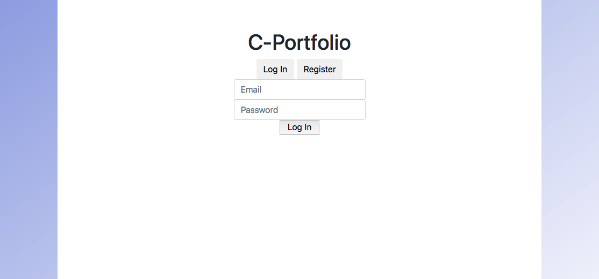
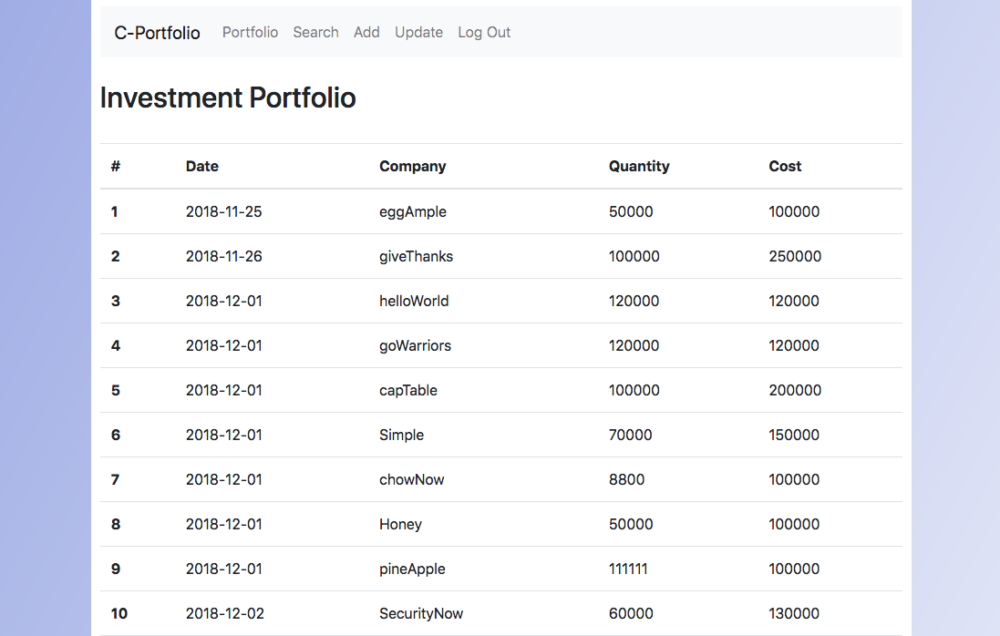
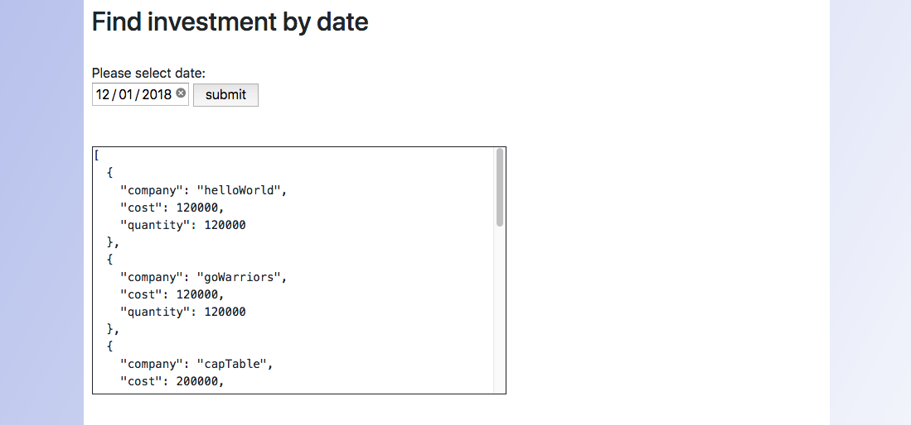
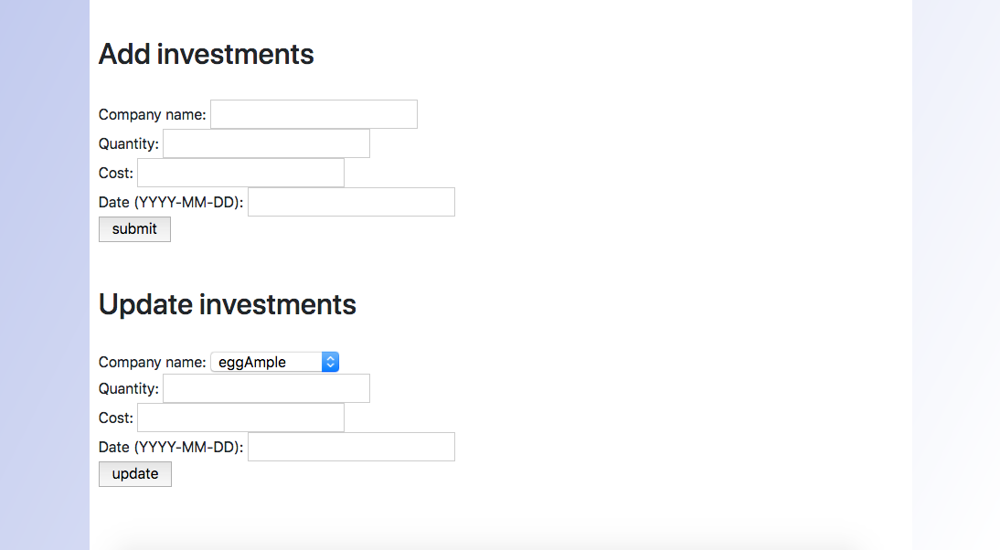

# C-Portfolio

### Summary
C-Portfolio is a virtual Investment Portfolio that manages investment data and has easy to use features to search investments by date, add new investments, and update existing ones.

### Technologies
Python 
Flask 
JavaScript (jQuery & Ajax)  
HTML, Jinja, CSS, Bootstrap 
PostgreSQL, SQLAlchemy

### Features
Search investments by date

 
Add or Update investments

 
